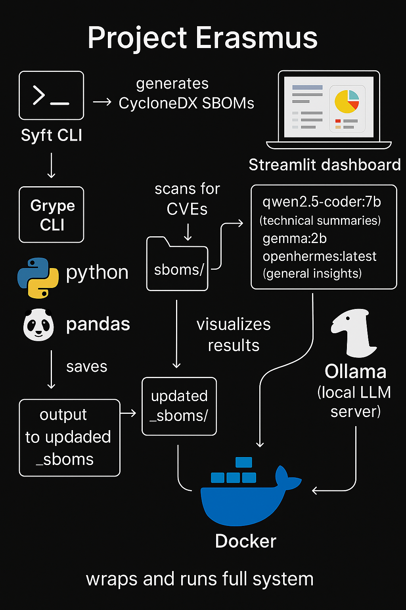

# 🤖 Project Erasmus — Reasoning Engine

Project Erasmus is a local, containerized reasoning engine designed to analyze software system data, visualize relationships, and generate GenAI-powered insights.

---

## 🚀 Features

- Parses SBOMs generated by Syft CLI (CycloneDX JSON)
- Runs Grype CLI scans for CVEs and enriches results
- Joins in vendor geo data (`vendor_geo.csv`)
- Visualizes data in an interactive Streamlit dashboard
- Integrates Ollama (local LLM) for summaries + Q&A
- Fully Dockerized for easy local demos and sharing

---

## 🏗 Tech stack

- **Syft CLI** → SBOM generation  
- **Grype CLI** → vulnerability scanning  
- **Python + pandas** → data enrichment  
- **Streamlit** → visual dashboard  
- **Ollama** → GenAI summarization + reasoning  
- **Docker + Compose** → portable environment

---

## 📸 Architecture diagram



---

## 💻 Setup

Clone the repo:
```bash
git clone https://github.com/stoic-dad/project-erasmus.git
cd project-erasmus...

Build and run with Docker Compose:
docker-compose up --build

Visit the dashboard at:
http://localhost:8501

⚙ Requirements
	•	Docker installed
	•	Optional: Ollama installed locally for LLM summaries

⸻

🙌 Shoutout

This project was a hands-on exploration of combining GenAI, software system complexity, and interactive reasoning. Named after Erasmus from Dune — one of the most unsettling thinking machines in sci-fi history — it’s a nod to curiosity and the challenge of understanding complex systems.

Happy to connect if you’re into AI reasoning, DevSecOps, or nerding out over cognitive systems!